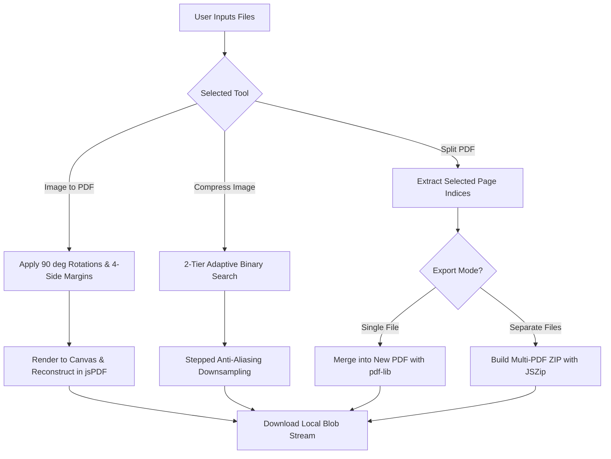

# 🌐 Localyze — Complete Architecture, Features & Logic Guide

> **100% Local, Private, Browser-Native Image & PDF Processing Suite**  
> Built with **React 19**, **TypeScript**, **Vite**, and styled with **Google Stitch Luminous Atmospheric Glassmorphism**.

---

## 📋 Table of Contents
1. [Executive Overview & Security Model](#1-executive-overview--security-model)
2. [Google Stitch Glassmorphic Design System](#2-google-stitch-glassmorphic-design-system)
3. [Core Algorithmic Logic & Engineering Deep Dive](#3-core-algorithmic-logic--engineering-deep-dive)
   - [3.1 Stepped Anti-Aliasing Downsampling](#31-stepped-anti-aliasing-downsampling)
   - [3.2 2-Tier Adaptive Binary Search Compression](#32-2-tier-adaptive-binary-search-compression)
   - [3.3 PDF Geometry & Multi-Page Budgeting Engine](#33-pdf-geometry--multi-page-budgeting-engine)
   - [3.4 Independent 4-Side PDF Margin System](#34-independent-4-side-pdf-margin-system)
   - [3.5 Memory Lifecycle & PWA Offline Architecture](#35-memory-lifecycle--pwa-offline-architecture)
4. [Tool-by-Tool Functional & Technical Breakdown](#4-tool-by-tool-functional--technical-breakdown)
   - [4.1 Precision Image Compressor](#41-precision-image-compressor)
   - [4.2 Precision PDF Compressor](#42-precision-pdf-compressor)
   - [4.3 PDF to Image Converter (DPI Presets)](#43-pdf-to-image-converter-dpi-presets)
   - [4.4 Universal Image Format Converter](#44-universal-image-format-converter)
   - [4.5 High-Fidelity Image Resizer & Transformer](#45-high-fidelity-image-resizer--transformer)
   - [4.6 Multi-Image to PDF Creator (with Independent Margins)](#46-multi-image-to-pdf-creator-with-independent-margins)
   - [4.7 PDF Merge Studio](#47-pdf-merge-studio)
   - [4.8 PDF Splitter & Page Extractor (Single/ZIP)](#48-pdf-splitter--page-extractor-singlezip)
   - [4.9 PDF Page Remover](#49-pdf-page-remover)
5. [System Data Flow & Architectural Diagrams](#5-system-data-flow--architectural-diagrams)
6. [Codebase Structure & Module Map](#6-codebase-structure--module-map)
7. [Getting Started & Local Execution](#7-getting-started--local-execution)

---

## 1. Executive Overview & Security Model

Localyze is designed with a **zero-server privacy architecture**. Unlike traditional online image and PDF converters that transmit sensitive documents to external cloud servers, Localyze executes all computing, rendering, decompression, manipulation, and re-encoding **inside the client browser via WebAssembly (Wasm), HTML5 Canvas 2D Context, and Web Workers**.

```
┌────────────────────────────────────────────────────────────────────────┐
│                          USER BROWSER RUNTIME                          │
│                                                                        │
│   [File Input] ──────► [HTML5 Canvas / PDF.js / pdf-lib]               │
│                                  │                                     │
│                         (In-Memory ArrayBuffer)                        │
│                                  │                                     │
│                                  ▼                                     │
│     [Compression Engine / Format Transcoders / jsPDF Pipeline]        │
│                                  │                                     │
│                                  ▼                                     │
│   [Local Blob URL Generation] ──► [Instant Client-Side Download]       │
└────────────────────────────────────────────────────────────────────────┘
                 ⛔ ZERO BYTES SENT OVER THE NETWORK ⛔
```

### Key Guarantees:
- **Zero Data Ingestion**: No analytics or telemetry captures document content.
- **Offline Functionality**: Works seamlessly without an active internet connection via Progressive Web App (PWA) service worker.
- **No Paywalls or Auth Walls**: Free, open, and unrestricted usage across all 9 utility modules.

---

## 2. Google Stitch Glassmorphic Design System

Localyze uses the **Luminous Atmospheric** glassmorphic design system generated with **Google Stitch**.

### 🎨 Visual Language & Color Palette
- **Cosmic Void Background**: `#0a0c14` (Deep space foundation)
- **Atmospheric Accent Glows**:
  - **Electric Cyan (`#00d2ff`)**: Primary interactive states, focus rings, and badges.
  - **Electric Violet (`#9d50bb`)**: Gradient endpoints and high-tech flair.
  - **Indigo Core (`#6366f1`)**: Structural buttons and active brand nodes.
  - **Emerald Green (`#10b981`)**: Success states, compression metrics, and download actions.
  - **Crimson Red (`#ef4444`)**: Deletion badges and destructive actions.

### 🔮 Surface Strategy & Physics
- **Dynamic Backdrop Blur**: `backdrop-filter: blur(20px) saturate(180%)`
- **Frosted Specular Highlight**: Top inner shadow `inset 0 1px 1px 0 rgba(255, 255, 255, 0.2)` creates edge-refraction refraction effects.
- **Multi-Layer Ambient Lighting**: 3 animated CSS orbs float beneath frosted layers (`floatOrb` and `pulseGlow` keyframe animations).
- **Typography Matrix**:
  - **Headings & Badges**: `Sora` (`700`, `800`) — high-tech, geometric, futuristic display font.
  - **Controls & Body Data**: `Inter` (`400`, `500`, `600`) — readable sans-serif optimized for numbers and UI controls.

---

## 3. Core Algorithmic Logic & Engineering Deep Dive

### 3.1 Stepped Anti-Aliasing Downsampling

When downscaling high-resolution images (e.g., $4000 \times 3000\text{px}$) directly in a single step, standard browser interpolation creates aliasing, jagged lines, and moiré patterns.

Localyze implements **iterative stepped downsampling** in [`imageCompression.ts`](file:///d:/YT/Localyze/src/utils/imageCompression.ts):

$$\text{Next Dimension} = \max(\text{Target Dimension}, \lfloor \text{Current Dimension} \times 0.5 \rfloor)$$

```typescript
export function steppedDownsample(
    sourceCanvas: HTMLCanvasElement | HTMLImageElement,
    targetWidth: number,
    targetHeight: number
): HTMLCanvasElement {
    let curWidth = sourceCanvas instanceof HTMLImageElement ? sourceCanvas.naturalWidth : sourceCanvas.width;
    let curHeight = sourceCanvas instanceof HTMLImageElement ? sourceCanvas.naturalHeight : sourceCanvas.height;

    let currentCanvas = document.createElement('canvas');
    currentCanvas.width = curWidth;
    currentCanvas.height = curHeight;
    let ctx = currentCanvas.getContext('2d')!;
    ctx.imageSmoothingEnabled = true;
    ctx.imageSmoothingQuality = 'high';
    ctx.drawImage(sourceCanvas, 0, 0);

    while (curWidth * 0.5 >= targetWidth && curHeight * 0.5 >= targetHeight) {
        const nextWidth = Math.floor(curWidth * 0.5);
        const nextHeight = Math.floor(curHeight * 0.5);

        const stepCanvas = document.createElement('canvas');
        stepCanvas.width = nextWidth;
        stepCanvas.height = nextHeight;
        const stepCtx = stepCanvas.getContext('2d')!;
        stepCtx.imageSmoothingEnabled = true;
        stepCtx.imageSmoothingQuality = 'high';
        stepCtx.drawImage(currentCanvas, 0, 0, curWidth, curHeight, 0, 0, nextWidth, nextHeight);

        currentCanvas = stepCanvas;
        curWidth = nextWidth;
        curHeight = nextHeight;
    }

    if (curWidth !== targetWidth || curHeight !== targetHeight) {
        const finalCanvas = document.createElement('canvas');
        finalCanvas.width = targetWidth;
        finalCanvas.height = targetHeight;
        const finalCtx = finalCanvas.getContext('2d')!;
        finalCtx.imageSmoothingEnabled = true;
        finalCtx.imageSmoothingQuality = 'high';
        finalCtx.drawImage(currentCanvas, 0, 0, curWidth, curHeight, 0, 0, targetWidth, targetHeight);
        return finalCanvas;
    }

    return currentCanvas;
}
```

---

### 3.2 2-Tier Adaptive Binary Search Compression

To hit an exact target file size (`20 KB`, `50 KB`, `100 KB`, `200 KB`, `500 KB`, `1 MB`), Localyze utilizes a **2-Tier Binary Search**:

1. **Tier 1 (Quantization Search)**: Probes JPEG quality $[0.01, 1.00]$ using binary search to find the highest quality that fits under the target size.
2. **Tier 2 (Area Scale Fallback)**: If an image exceeds the target size even at minimum quality $0.01$, it dynamically downscales the canvas by:
   $$\text{scaleFactor} = \max\left(0.15, \sqrt{\frac{\text{targetBytes}}{\text{sizeAtMinQuality}}} \times 0.90\right)$$
   and re-runs the fine search.

---

### 3.3 PDF Geometry & Multi-Page Budgeting Engine

Localyze extracts original page viewports using `pdfjs-dist` and reconstructs each page in `jsPDF` using points (`pt`), preserving mixed portrait/landscape documents and blueprints without distortion.

---

### 3.4 Independent 4-Side PDF Margin System

The Image-to-PDF engine in [`ImageToPdf.tsx`](file:///d:/YT/Localyze/src/pages/tools/ImageToPdf.tsx) provides a full **4-side independent margin matrix**:
- **Top Margin ($M_t$) & Bottom Margin ($M_b$)**: Can be set to $0\text{mm}$ to remove header/footer white space.
- **Left Margin ($M_l$) & Right Margin ($M_r$)**: Configurable independently (e.g. $15\text{mm}$ left margin for 2-hole or 3-hole document binding).
- **Printable Area Calculation**:
  $$W_{\text{printable}} = W_{\text{page}} - (M_l + M_r)$$
  $$H_{\text{printable}} = H_{\text{page}} - (M_t + M_b)$$

---

### 3.5 Memory Lifecycle & PWA Offline Architecture

- **Code-Splitting & Vendor Chunking**: Routes are split via `React.lazy()`. Heavy packages (`pdfjs-dist`, `jspdf`, `pdf-lib`, `heic2any`) load on-demand.
- **Service Worker Offline Caching**: `public/sw.js` caches static application assets so the suite is fully operational offline without internet.
- **Global Error Boundary**: `<ErrorBoundary>` component catches file parsing anomalies and provides a 1-click recovery state.

---

## 4. Tool-by-Tool Functional & Technical Breakdown

### 4.1 Precision Image Compressor
- **Route**: `/tools/compress`
- **Features**: 1-Click Presets (`20 KB` to `2 MB`), max resolution limiter (`4K`, `1080p`, `720p`, `800px`), output format selection (`JPEG`, `WebP`, `PNG`), live probe telemetry, and side-by-side preview.

### 4.2 Precision PDF Compressor
- **Route**: `/tools/compress-pdf`
- **Features**: 1-Click presets (`20 KB` to `5 MB`), DPI selectors (54–144 DPI), and multi-page adaptive budgeting.

### 4.3 PDF to Image Converter (DPI Presets)
- **Route**: `/tools/pdf-to-jpg`
- **Features**: Rasterize PDF pages to standalone images with selectable DPI (72 to 300 DPI) and format choices (`JPG`, `PNG`, `WebP`), with bulk ZIP download.

### 4.4 Universal Image Format Converter
- **Route**: `/tools/convert`
- **Features**: Transcodes PNG, JPG, WebP, BMP, TIFF, HEIC, AVIF, SVG, ICO with transparency preservation.

### 4.5 High-Fidelity Image Resizer & Transformer
- **Route**: `/tools/resize`
- **Features**: Dual mode (exact pixels `px` or scale percentage `%`), aspect ratio presets (`1:1`, `4:3`, `16:9`, `9:16`, `3:2`), 90° rotation, horizontal flip, and live image preview.

### 4.6 Multi-Image to PDF Creator (with Independent Margins)
- **Route**: `/tools/pdf`
- **Features**: 4-side independent margins ($M_t, M_b, M_l, M_r$), 1-click margin presets, per-image 90° rotation, auto page orientation (detects portrait vs landscape per image), and standard sizes (A4, Letter, A3, A5, Fit).

### 4.7 PDF Merge Studio
- **Route**: `/tools/merge-pdf`
- **Features**: Combine 2 or more PDF documents into a master file with thumbnail previews and page order controls.

### 4.8 PDF Splitter & Page Extractor (Single/ZIP)
- **Route**: `/tools/split-pdf`
- **Features**: Batch selection shortcuts (*Select All, Clear, Invert, Odd Pages, Even Pages*), and choice between single merged PDF output or individual page PDFs in a ZIP file.

### 4.9 PDF Page Remover
- **Route**: `/tools/remove-pages`
- **Features**: Visual click-to-delete page selection, quick filter chips (*Remove Odd, Remove Even, First, Last*), and live telemetry counter.

---

## 5. System Data Flow & Architectural Diagrams



---

## 6. Codebase Structure & Module Map

```
Localyze/
├── index.html                   # HTML entry point with PWA link
├── public/
│   ├── manifest.json            # PWA Web App Manifest
│   └── sw.js                    # Cache-first offline service worker
├── package.json                 # Cleaned dependencies (100% client-side)
├── tsconfig.json                # TypeScript strict configuration
├── vite.config.ts               # Vendor manualChunks bundle splitting
├── src/
│   ├── main.tsx                 # Root render & service worker registration
│   ├── App.tsx                  # Lazy-loaded routes & glowing suspense loader
│   ├── index.css                # Glassmorphic utilities & keyframe animations
│   ├── styles/
│   │   └── theme.css            # Stitch atmospheric design tokens
│   ├── components/
│   │   ├── ErrorBoundary.tsx    # Global React Error Boundary with retry UI
│   │   ├── Layout.tsx           # Ambient glowing orbs & frosted layout
│   │   ├── Navbar.tsx           # Frosted glass header
│   │   ├── FileUploader.tsx     # Drag-and-drop dropzone
│   │   └── ProgressBar.tsx      # Progress telemetry
│   ├── utils/
│   │   └── imageCompression.ts  # Precision binary search & stepped downsample
│   └── pages/
│       ├── Home.tsx             # Stitch glassmorphic tool cards
│       └── tools/
│           ├── ImageCompressor.tsx # Resolution limiter & target presets
│           ├── PdfCompressor.tsx   # Precision PDF compressor
│           ├── PdfToJpg.tsx        # DPI selector & format choices
│           ├── ImageConverter.tsx  # Universal format converter
│           ├── ImageResizer.tsx    # Pixel/percent mode, aspect ratios, flip & rotate
│           ├── ImageToPdf.tsx      # Independent 4-side margins & image rotation
│           ├── PdfMerge.tsx        # Multi-document merger
│           ├── PdfSplit.tsx        # Batch selection & ZIP/Single export
│           └── PdfRemovePages.tsx  # Batch deletion & live telemetry
```

---

## 7. Getting Started & Local Execution

### Installation & Run
```bash
# Clone & install
git clone https://github.com/hariharans99/Localyze.git
cd Localyze
npm install

# Start development server
npm run dev

# Production Build
npm run build
```
Open **[http://localhost:5173](http://localhost:5173)** in any modern web browser.

---

## 📄 License
- **License**: MIT License — open-source, free, private, and offline-capable.
